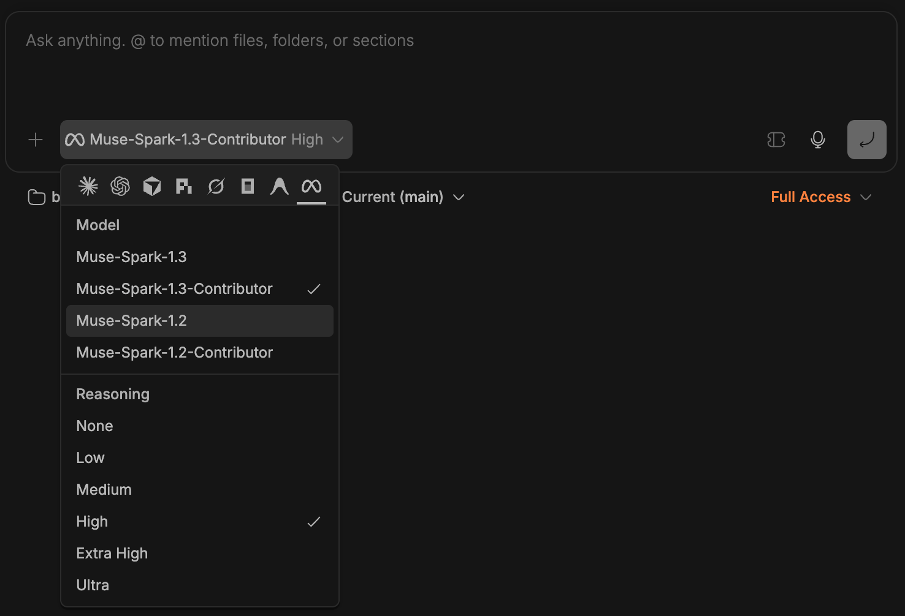

# Muse Code (ACP)

Registers [Muse Code](https://github.com/BrokkAi/muse-acp) as a first-class bb
agent provider, so it carries its own name and icon everywhere bb shows a
provider — instead of the generic tool glyph a `customAgents` entry gets.



*Muse Code picked in the composer — its own mark, its own models, and the reasoning
levels it actually implements.*

## How it works

Muse Code does not speak bb's protocol. It speaks its own Muse Session
Protocol (MSP), so a translator sits between them:

```
bb  ──ACP──▶  acp-tap (stdio shim)  ──ACP──▶  muse-acp  ──MSP──▶  Muse Code
```

[`muse-acp`](https://github.com/BrokkAi/muse-acp) is that translator: an
independent, dependency-free Rust bridge by Brokk.ai, Apache-2.0. This plugin
does not vendor or rebuild it — `bb muse-code install` downloads the release
the project publishes and checks it against the SHA-256 published beside it.
Tested against **v0.9.0** with Muse Code 1.4.1.

Between bb and the adapter sits `acp-tap.mjs`, a ~100-line stdio
passthrough this plugin writes to `~/.bb/plugins/muse-code/` on startup. It
proxies the ACP wire unchanged and tees `usage_update` snapshots — Muse's
cumulative token totals plus the adapter's list-price cost estimate — into
`~/.bb/acp-tap/<sessionId>.jsonl`, along with a `turn_timing` record per
prompt carrying chunk *timestamps* only (never content), so a reader can
decompose a turn into TTFT / generation / settle-tail spans. bb's bridge
maps the context meter from `usage_update` itself; the tap exists so
turn-stats (or any consumer) can recover the *per-turn* deltas and timing
the bridge drops. Removing the shim changes nothing about how sessions run —
only the side-channel capture stops.

## What works

| | | |
| --- | --- | --- |
| Token and context usage | yes | Reported by Muse, not estimated by bb — the adapter forwards MSP session usage as ACP `usage_update` |
| Model picker | yes | From your signed-in account: `muse-spark-1.3`, `-contributor`, and the 1.2 pair |
| Reasoning effort | yes | Seven levels, None to Ultra, from what the adapter reports |
| Tool approvals | yes | Muse's permission requests surface as bb permission prompts; bb's own mode decides |
| Session resume | yes | The adapter advertises `list`, `resume`, `close` |
| Muse skills | yes | Arrive as ACP commands in the `/` typeahead |
| Goal and plan | yes | Composer actions insert `/goal` and `/plan`; the adapter maps `/goal` onto Muse's goal methods |
| Manual compaction | yes | bb sends `/compact`, which the adapter submits to Muse natively |
| bb's MCP tools | yes | Forwarded to Muse over typed session MCP since adapter v0.8.0 |
| Images in prompts | yes | Text, images, and embedded context |
| Subscription quota | no | Muse exposes no quota endpoint, so bb's usage panel omits it |
| Thread fork | yes (tip) | The adapter advertises `session/fork` since v0.3.0 |
| Thread archive / rename | no | bb's ACP bridge forwards neither; `/rename` still works as a Muse command |
| In-app Install button | no | bb offers one only for agents in its built-in dialect list; Muse is not in it. Use `bb muse-code install` |

## Install

```sh
bb plugin install git:https://github.com/pzoltowski/bb-plugins.git@semver:muse-code/:^0.3.0 --plugin muse-code
bb muse-code install
```

The second command downloads the upstream release for the machine's platform,
verifies it against the SHA-256 the project publishes beside each asset, and
installs it to `~/.local/bin` — the same place the project's own `install.sh`
uses, so the two paths agree. `--machine <id-or-name>` installs on another
machine; `--version <x.y.z>` pins one; `--force` reinstalls.

Muse Code itself still needs its own CLI, which is where authentication lives.
The adapter can install it and sign you in:

```sh
muse-acp login   # installs Muse Code if missing, then runs `muse login`
```

`bb muse-code status` reports both, so it always says which piece is missing.

## What this fixes versus a `customAgents` entry

| | `customAgents` | this plugin |
| --- | --- | --- |
| Icon | `Toolbox` generic glyph | Meta mark, tinted |
| Reasoning levels | `low…max` — drops `none`/`ultra` | the seven Muse levels bb can express |
| Service tiers | `default`/`fast` — Muse has neither | none |
| Sign-in hint | generic | points at `muse-acp login`, which installs Muse if needed and signs in |
| Getting the binary | find it yourself | `bb muse-code install` |

## What the adapter advertises

Read from muse-acp v0.9.0, `src/main.rs` (`V1_INIT` / `V2_INIT`) and
`src/acp.rs` (`config_options`), and confirmed against a live handshake:

| | |
| --- | --- |
| Auth | `muse-login`, a terminal method that runs `muse-acp login`. bb's bridge runs only headless auth methods, so sign-in happens out of band |
| Sessions | `loadSession: true`; capabilities `list`, `resume`, `close`, `fork` |
| Prompt | text, image, embedded context; no audio |
| Approval mode | `allowAll`, `promptUnmatched`, `onRequest`, `denyUnmatched` (Muse's own names since v0.5.0) |
| MCP | HTTP servers forwarded to Muse |
| Commands | `compact`, `goal`, `rename`, `workflow-child`, plus Muse's skills |
| Reasoning effort | `default` (Muse's configured tier), `none`, `minimal`, `low`, `medium`, `high`, `xhigh`, `max`, `ultra` |

bb's own vocabularies differ, so the registration maps onto them: permission
modes are `accept-edits`, `auto`, `full`; reasoning levels are `none`, `low`,
`medium`, `high`, `xhigh`, `ultracode`, `max`, `ultra`. Muse's `minimal` has no
bb equivalent and is dropped.

## Provider id

`acp-muse-code`. It is permanent once published, and it collides with a
`customAgents` entry using the same id — remove that entry when installing this
plugin.
